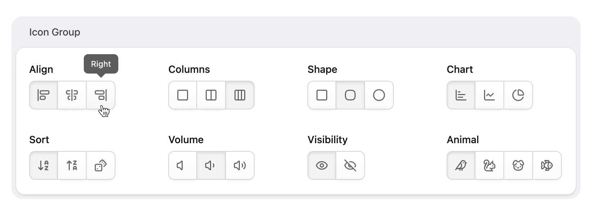

# Statamic Icon Group Fieldtype

Button group fieldtype with icons and tooltips for a compact way of offering multiple choices.



## Installation

Install the addon via Composer:

```bash
composer require daun/statamic-icon-group-fieldtype
```

## Usage

The fieldtype extends the native [Button Group](https://statamic.dev/fieldtypes/button_group) fieldtype. If you already have such a field in a blueprint, you can change its type to `icon_group` and add an `icon` key to each option.

```diff
visibility:
- type: button_group
+ type: icon_group
  display: Visibility
  options:
    -
      value: Public
      key: public
+     icon: eye
    -
      value: Private
      key: private
+     icon: eye-slash
```

To create a new field using this type, add the field from the control panel and choose `Button Group` as fieldtype.

## Custom Icon Sets

Icons are pulled from the built-in control panel icon set. To use icons from a different set, change the `Icon set` option.

### Example: Lucide

The example steps below will install and use icons from the [Lucide](https://lucide.dev/icons/) icon set.

Install icon set:

```sh
npm install lucide-static
```

Register icon set in control panel:

```js
// resource/js/cp.js

import { registerIconSet } from '@statamic/cms/ui';

Statamic.booting(() => {
    registerIconSet('lucide', import.meta.glob(
        '../../node_modules/lucide-static/icons/*.svg',
        { query: '?raw', import: 'default' }
    ));
});
```

Switch field to use icon set:

```diff
visibility:
  type: icon_group
  display: Visibility
+ set: lucide
  options:
    -
      value: Public
      key: public
    -
      value: Private
      key: private
      icon: eye-off
```

## License

[MIT](https://opensource.org/licenses/MIT)
