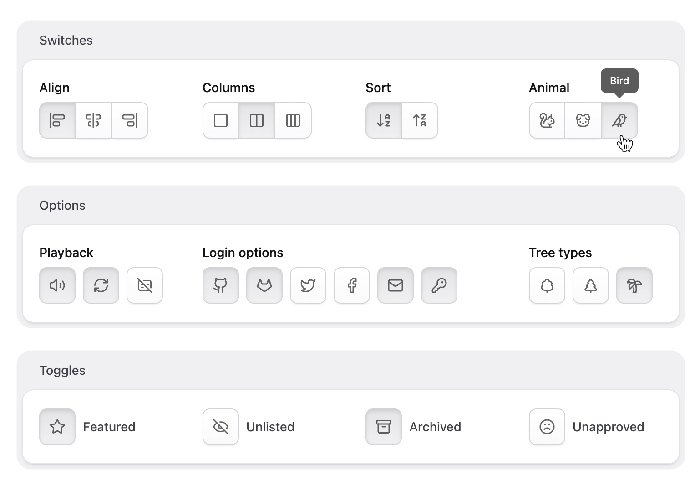
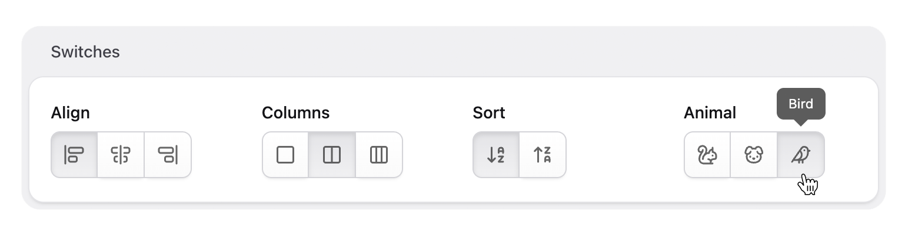
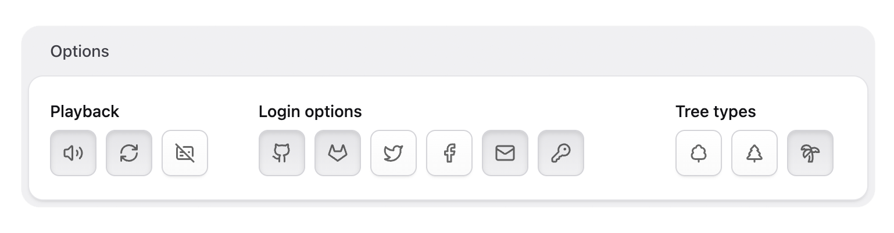
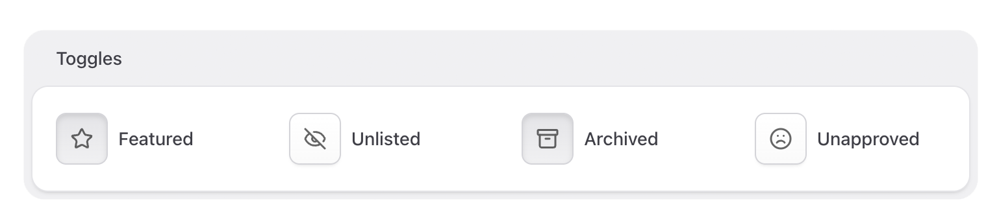

# Statamic Icon Button Fieldtypes

Icon-only button fieldtypes for compact toggles and switches.



## Installation

Install the addon via Composer:

```bash
composer require daun/statamic-icon-button-fieldtypes
```

## Fieldtypes

The addon ships with three fieldtypes, each extending a native Statamic fieldtype:

- Single-choice **[Icon Group](#icon-group)** extends the native Button Group
- Multi-Choice **[Icon Toggles](#icon-toggles)** extends the Checkboxes fieldtype
- Boolean **[Icon Toggle](#icon-toggle)** extends the Toggle fieldtype

### Icon Group

The **Icon Group** fieldtype extends the native [Button Group](https://statamic.dev/fieldtypes/button_group)
fieldtype and allows selecting a single option from a predefined set of options.



```diff
align:
  display: Align
- type: button_group
+ type: icon_group
  options:
    -
      value: Left
      key: left
+     icon: align-start-vertical
    -
      value: Right
      key: right
+     icon: align-end-vertical
```

## Icon Toggles

The **Icon Toggles** fieldtype extends the native [Checkboxes](https://statamic.dev/fieldtypes/checkboxes)
fieldtype and allows selecting one or more options from a predefined set of options.



```diff
playback:
  display: Playback options
- type: checkboxes
+ type: icon_toggles
  options:
    -
      value: sound
      key: sound
+     icon: volume
    -
      value: Loop
      key: loop
+     icon: repeat
    -
      value: Captions
      key: captions
+     icon: captions
```

## Icon Toggle

The **Icon Toggle** fieldtype extends the native [Toggle](https://statamic.dev/fieldtypes/toggle)
fieldtype and allows switching a single value on or off.



```diff
featured:
  display: Featured
- type: toggle
+ type: icon_toggle
+ button_icon: star
```

Note that the option here is called `button_icon` because `icon` key is a reserved key by Statamic.

## Custom Icon Sets

Icons are pulled from the built-in icon set. To use icons from a different set, [register a custom icon set](https://statamic.dev/fieldtypes/icon#icon-sets) and change the `set` option of each field to the desired set.

### Example: Lucide

Install and use the [Lucide](https://lucide.dev/icons/) icon set, used in the examples above.

```sh
npm install lucide-static
```

Register the icon set in your service provider.

```php
use Statamic\Facades\Icon; 

class AppServiceProvider extends ServiceProvider {
  public function register() {
    Icon::register('lucide', base_path('node_modules/lucide-static/icons'));
  }
}
```

Switch the field to use the custom icon set.

```diff
featured:
  display: Featured
  type: icon_toggle
  button_icon: star
+ set: lucide
```

### Example: Local SVGs

You can also use local SVG icons in your resources folder.

```php
Icon::register('payments', resource_path('icons/payments'));
```

## License

[MIT](https://opensource.org/licenses/MIT)
